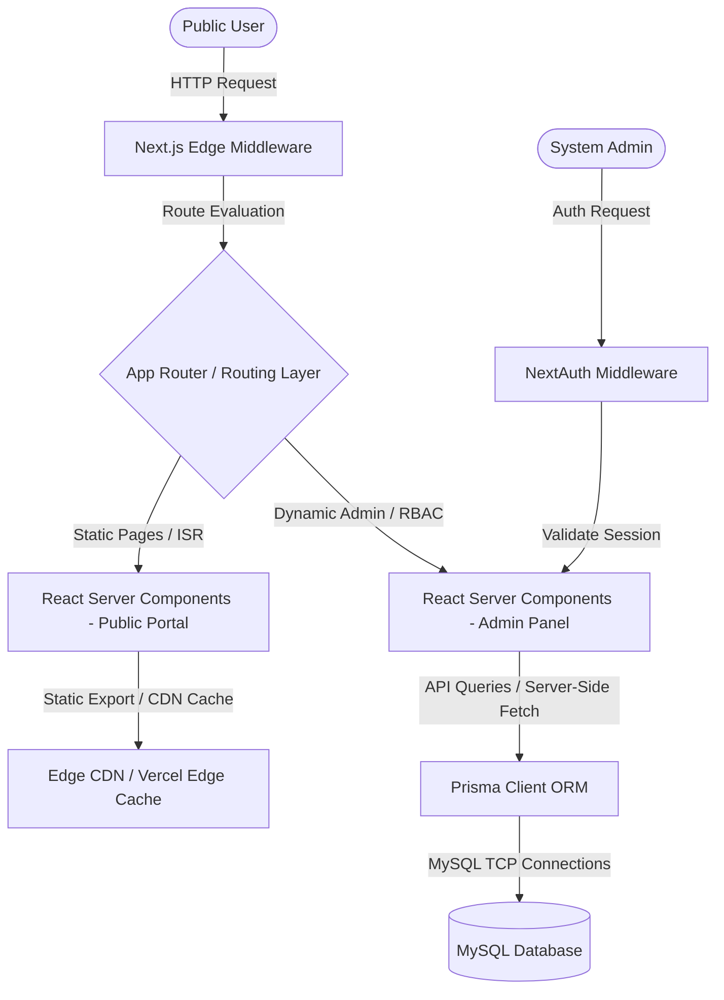
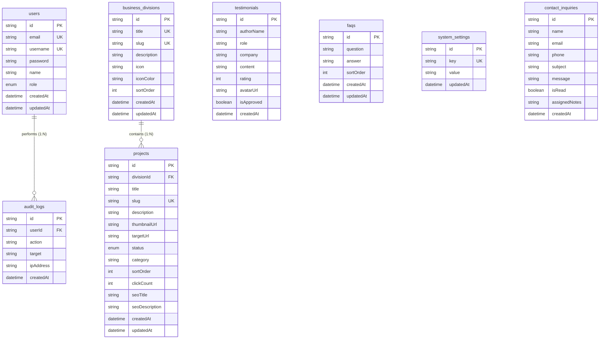

# Medicxus Group Corporate Portfolio Platform
## Enterprise-Grade Technical Blueprint & System Architecture Plan
### Part 1: Core System Foundations (Chapters 1 - 6)

---

## 1. System Architecture

The Medicxus Group Corporate Portfolio Platform is designed as an enterprise-grade web application utilizing the state-of-the-art **Next.js 15 (App Router)** framework. It leverages React Server Components (RSC) by default to deliver maximum performance, minimal bundle sizes, and robust SEO capabilities.

### 1.1 Next.js 15 App Router Architecture
The application is structured around a dual-layer strategy:
*   **Public Portal (Sub-second FCP):** Leveraging **Static Site Generation (SSG)** and **Incremental Static Regeneration (ISR)** to compile the main landing page, business division landing pages, and educational blogs. Changes in the CMS will trigger targeted revalidation using Next.js tag-based revalidation (`revalidateTag`).
*   **Admin Console (Dynamic & Stateful):** Operating entirely via **Dynamic Server-Side Rendering (SSR)** and client-side rendering where high-fidelity interactivity is needed. It implements JWT-based authentication guards and session handling at the Edge.



### 1.2 Client vs. Server Component Boundaries
To achieve optimum performance, the architecture strictly delineates client and server responsibilities:
*   **React Server Components (RSC):** Utilized for 90% of the public facing content. This includes fetching hero contents, business divisions list, project cards, and FAQs directly from the MySQL database using Prisma. No Javascript is shipped to the client for rendering these blocks.
*   **Client Components (`'use client'`):** Restricted to high-fidelity, user-interactive blocks:
    *   **Interactive Cards / Links:** For client-side hover micro-animations and transition handling.
    *   **TipTap WYSIWYG Editor:** In the Admin Panel.
    *   **File Upload Interfaces:** Drag-and-drop components with progress bars.
    *   **Form Submissions:** Contact forms with client-side Zod validation.
    *   **TanStack Query Providers:** For client-side data fetching and optimistic state updates in the Admin Dashboard.

### 1.3 Unified Request-Response Lifecycle Pipeline
All dynamic incoming requests flow through a structured pipeline to ensure safety, tracking, and operational security:
1.  **Ingress:** Cloudflare / Next Edge Middleware filters request origin, checks security headers, and assesses rate limit criteria.
2.  **Routing & Guarding:** Next.js middleware inspects path. If matching `/admin/*`, the NextAuth session token is checked. Unauthorized attempts are instantly redirected to `/login`.
3.  **Data Hydration:** Server Components perform parallel database queries using Prisma (`Promise.all`), rendering the HTML on the server.
4.  **Client Hydration:** Client receives HTML, downloads lightweight Javascript chunks, and activates hover effects and form triggers.

---

## 2. Folder Structure

The directory structure is organized according to the **Modular Clean Architecture** pattern. This separates the codebase by technical layers and modular domain features, preventing tight coupling and facilitating the extraction of sub-services into standalone Next.js apps or micro-frontends in the future.

```text
medicxus-platform/
├── .env.production
├── .env.development
├── package.json
├── tsconfig.json
├── tailwind.config.ts
├── postcss.config.js
├── prisma/
│   ├── schema.prisma          # Database schema definitions
│   ├── migrations/            # SQL migration history
│   └── seed.ts                # Database seed script
├── public/
│   ├── fonts/                 # Local Outfit and DM Sans font files
│   ├── uploads/               # Local file storage for CMS assets (images, documents)
│   └── assets/                # Static theme graphics and system SVGs
├── src/
│   ├── middleware.ts          # Route guards and authorization handler
│   ├── app/                   # Next.js App Router root
│   │   ├── layout.tsx         # Main HTML and root context providers
│   │   ├── page.tsx           # Sovereign Blue Landing Page (RSC)
│   │   ├── login/
│   │   │   └── page.tsx       # NextAuth login page
│   │   ├── admin/             # Isolated Admin Console Routing
│   │   │   ├── layout.tsx     # Admin sidebar and layout
│   │   │   ├── page.tsx       # Admin Dashboard Analytics overview
│   │   │   ├── divisions/     # Business divisions management
│   │   │   ├── projects/      # Project and link configuration
│   │   │   ├── blogs/         # Blog content CMS
│   │   │   └── inquiries/     # Lead and contact submission views
│   │   └── api/               # Unified Next.js API Routes (Backend REST API)
│   │       ├── auth/[...nextauth]/
│   │       │   └── route.ts   # NextAuth authentication config
│   │       ├── divisions/     # CRUD API endpoint for Business units
│   │       ├── projects/      # CRUD API endpoint for projects & tracking urls
│   │       ├── media/         # Media local-upload endpoint
│   │       └── inquiries/     # Lead submission webhook/POST endpoint
│   ├── components/            # Reusable UI Components
│   │   ├── ui/                # Radix UI wrapper primitives (Shadcn UI)
│   │   │   ├── button.tsx
│   │   │   ├── dialog.tsx
│   │   │   ├── input.tsx
│   │   │   └── card.tsx
│   │   ├── main/              # Sovereign Blue Specific Public Elements
│   │   │   ├── navbar.tsx     # Client-approved Navigation
│   │   │   ├── hero.tsx       # Dark animated Hero section
│   │   │   ├── stats.tsx      # Standard corporate statistics line
│   │   │   ├── division-card.tsx
│   │   │   └── footer.tsx     # Fully styled standard footer
│   │   └── admin/             # Specialized Admin Dashboard UI controls
│   ├── hooks/                 # Shared React hooks (e.g. use-toast, use-debounce)
│   ├── lib/                   # Core core framework utilities
│   │   ├── prisma.ts          # Single-instance Prisma Client database connector
│   │   ├── query.ts           # TanStack Query Config Client
│   │   └── utils.ts           # Tailwind CSS merging utilities (clsx, tailwind-merge)
│   ├── types/                 # Universal TypeScript definitions
│   └── validation/            # Central Zod validation schemas
│       ├── auth.ts
│       ├── project.ts
│       └── inquiry.ts
```

---

## 3. Frontend Architecture

To maintain absolute pixel-fidelity with the **Sovereign Blue** design specification, the frontend architecture implements CSS custom variables linked into the Tailwind utility compiler, high-performance typography, and responsive component primitives.

### 3.1 Tailwind CSS Sovereign Blue Configuration
The Tailwind CSS config overrides the default colors, shadows, and animations to align directly with the client-approved color palette:

```typescript
// tailwind.config.ts
import type { Config } from "tailwindcss";

const config: Config = {
  darkMode: ["class"],
  content: [
    "./src/pages/**/*.{js,ts,jsx,tsx,mdx}",
    "./src/components/**/*.{js,ts,jsx,tsx,mdx}",
    "./src/app/**/*.{js,ts,jsx,tsx,mdx}",
  ],
  theme: {
    container: {
      center: true,
      padding: "2rem",
      screens: {
        "2xl": "1400px",
      },
    },
    extend: {
      colors: {
        navy: {
          DEFAULT: "#0F4C81",
          hover: "#0a3a65",
        },
        teal: {
          DEFAULT: "#14B8A6",
          light: "#F0FDFA",
        },
        amber: {
          DEFAULT: "#F59E0B",
          dark: "#D97706",
          light: "#FFFBEB",
        },
        dark: {
          DEFAULT: "#0B1220",
          medium: "#0F2D4F",
          light: "#0a2540",
        },
        canvas: "#F8FAFC",
        border: "#E2E8F0",
        body: "#475569",
        heading: "#0F172A",
        muted: "#94A3B8",
        highlight: {
          blue: "#EFF6FF",
          purple: "#F5F3FF",
        }
      },
      fontFamily: {
        outfit: ["var(--font-outfit)", "sans-serif"],
        dmsans: ["var(--font-dmsans)", "sans-serif"],
      },
      borderRadius: {
        card: "18px",
        input: "10px",
        btn: "11px",
      },
      boxShadow: {
        premium: "0 24px 48px rgba(15, 76, 129, 0.11)",
        btnNavy: "0 4px 12px rgba(15, 76, 129, 0.3)",
        btnAmber: "0 4px 12px rgba(245, 158, 11, 0.25)",
      },
      keyframes: {
        pulseDot: {
          "0%, 100%": { opacity: "1", transform: "scale(1)" },
          "50%": { opacity: ".5", transform: "scale(1.4)" },
        },
        fadeDown: {
          from: { opacity: "0", transform: "translateY(-12px)" },
          to: { opacity: "1", transform: "translateY(0)" },
        },
        fadeUp: {
          from: { opacity: "0", transform: "translateY(20px)" },
          to: { opacity: "1", transform: "translateY(0)" },
        }
      },
      animation: {
        pulseDot: "pulseDot 2s infinite ease-in-out",
        fadeDown: "fadeDown 0.6s ease both",
        fadeUp: "fadeUp 0.7s ease both",
      }
    },
  },
  plugins: [require("tailwindcss-animate")],
};

export default config;
```

### 3.2 Global Fonts & Typography Integration
To guarantee flawless text layout matching, the application imports Google Fonts using Next.js's built-in optimization package `next/font/google`:

```typescript
// src/app/layout.tsx
import { Outfit, DM_Sans } from "next/font/google";
import "../styles/globals.css";

const outfit = Outfit({
  subsets: ["latin"],
  weight: ["300", "400", "500", "600", "700", "800", "900"],
  variable: "--font-outfit",
  display: "swap",
});

const dmSans = DM_Sans({
  subsets: ["latin"],
  weight: ["300", "400", "500", "600"],
  style: ["normal", "italic"],
  variable: "--font-dmsans",
  display: "swap",
});

export default function RootLayout({
  children,
}: {
  children: React.ReactNode;
}) {
  return (
    <html lang="en" className={`${outfit.variable} ${dmSans.variable} scroll-smooth`}>
      <body className="font-outfit bg-canvas text-heading antialiased overflow-x-hidden">
        {children}
      </body>
    </html>
  );
}
```

### 3.3 State Management & Asynchronous Data Fetching
*   **TanStack Query (React Query v5):** Employed for client-side state synchronization, query caching, and mutations inside the Admin dashboard. Queries utilize auto-refetching, request de-duplication, and optimistic interface rendering when managing project cards.
*   **React Hook Form & Zod:** Manages all complex form configurations, verifying validations in real-time on keypress before dispatching mutation requests.

---

## 4. Backend Architecture

Next.js API Routes (`/src/app/api/*`) operate as the micro-backend layer, executing securely in a Node.js server environment with robust CORS, session handling, validation mechanisms, and database management.

### 4.1 Next.js 15 REST API Route Structure
Endpoints represent standard JSON REST pipelines, implementing clean error envelopes to simplify client integrations:

```typescript
// Example Endpoint Structure: src/app/api/projects/route.ts
import { NextRequest, NextResponse } from "next/server";
import { prisma } from "@/lib/prisma";
import { getServerSession } from "next-auth";
import { authOptions } from "../auth/[...nextauth]/route";
import { projectCreateSchema } from "@/validation/project";

export async function GET(req: NextRequest) {
  try {
    const { searchParams } = new URL(req.url);
    const category = searchParams.get("category");
    const status = searchParams.get("status");

    const filter: any = {};
    if (category) filter.category = category;
    if (status) filter.status = status;

    const projects = await prisma.project.findMany({
      where: filter,
      orderBy: { sortOrder: "asc" },
    });

    return NextResponse.json({ success: true, data: projects }, { status: 200 });
  } catch (error: any) {
    return NextResponse.json(
      { success: false, message: "Internal server error", error: error.message },
      { status: 500 }
    );
  }
}

export async function POST(req: NextRequest) {
  try {
    const session = await getServerSession(authOptions);
    if (!session || session.user.role !== "ADMIN") {
      return NextResponse.json({ success: false, message: "Unauthorized" }, { status: 401 });
    }

    const body = await req.json();
    const validatedData = projectCreateSchema.parse(body);

    const project = await prisma.project.create({
      data: validatedData,
    });

    return NextResponse.json({ success: true, data: project }, { status: 201 });
  } catch (error: any) {
    if (error.name === "ZodError") {
      return NextResponse.json({ success: false, errors: error.errors }, { status: 400 });
    }
    return NextResponse.json(
      { success: false, message: "Internal server error" },
      { status: 500 }
    );
  }
}
```

### 4.2 Middleware Pipeline & Global Edge Protection
A global middleware handles geolocation tracking, adds secure CORS headers, enforces CSRF checks, and restricts `/admin` folder paths:

```typescript
// src/middleware.ts
import { withAuth } from "next-auth/middleware";
import { NextResponse } from "next/server";

export default withAuth(
  function middleware(req) {
    const response = NextResponse.next();
    
    // Add Security Headers
    response.headers.set("X-Frame-Options", "DENY");
    response.headers.set("X-Content-Type-Options", "nosniff");
    response.headers.set("Referrer-Policy", "strict-origin-when-cross-origin");
    response.headers.set(
      "Content-Security-Policy",
      "default-src 'self'; script-src 'self' 'unsafe-inline' 'unsafe-eval'; style-src 'self' 'unsafe-inline' fonts.googleapis.com; font-src 'self' fonts.gstatic.com; img-src 'self' data: blob:;"
    );
    
    return response;
  },
  {
    callbacks: {
      authorized: ({ token }) => !!token, // Validates presence of verified JWT session token
    },
    pages: {
      signIn: "/login",
    },
  }
);

export const config = {
  matcher: ["/admin/:path*", "/api/admin/:path*"],
};
```

---

## 5. Database Design

MySQL serves as the core database engine. The design relies on normalized tables to maintain integrity, but introduces indexes to speed up routing operations (like link redirection queries and frontend sitemaps).

### 5.1 Prisma Schema Specification (Database Blueprint)
Here is the fully engineered, schema-compliant `schema.prisma` configuration file:

```prisma
datasource db {
  provider = "mysql"
  url      = env("DATABASE_URL")
}

generator client {
  provider = "prisma-client-js"
}

enum Role {
  SUPER_ADMIN
  EDITOR
  AUDITOR
}

enum ProjectStatus {
  ACTIVE
  IN_DEVELOPMENT
  MAINTENANCE
  REDIRECTED
}

model User {
  id        String   @id @default(uuid())
  email     String   @unique
  username  String   @unique
  password  String   // Managed with bcrypt hashing
  name      String
  role      Role     @default(EDITOR)
  createdAt DateTime @default(now())
  updatedAt DateTime @updatedAt
  logs      AuditLog[]

  @@map("users")
}

model BusinessDivision {
  id          String    @id @default(uuid())
  title       String    @unique
  slug        String    @unique
  description String    @db.Text
  icon        String    // Emojis/Unicode references (e.g., '🎓', '🏥')
  iconColor   String    // Mapped variable (e.g., 'icon-blue', 'icon-teal')
  sortOrder   Int       @default(0)
  createdAt   DateTime  @default(now())
  updatedAt   DateTime  @updatedAt
  projects    Project[]

  @@index([slug])
  @@map("business_divisions")
}

model Project {
  id                 String           @id @default(uuid())
  divisionId         String
  division           BusinessDivision @relation(fields: [divisionId], references: [id], onDelete: Cascade)
  title              String
  slug               String           @unique
  description        String           @db.Text
  thumbnailUrl       String           @db.VarChar(512)
  targetUrl          String           @db.VarChar(512) // Destination website address
  status             ProjectStatus    @default(IN_DEVELOPMENT)
  category           String           // Mapped taxonomy ('Education', 'Healthcare', etc.)
  sortOrder          Int              @default(0)
  clickCount         Int              @default(0) // Redirect analytics tracking
  seoTitle           String?          @db.VarChar(120)
  seoDescription     String?          @db.VarChar(255)
  createdAt          DateTime         @default(now())
  updatedAt          DateTime         @updatedAt

  @@index([divisionId])
  @@index([slug])
  @@map("projects")
}

model Testimonial {
  id         String   @id @default(uuid())
  authorName String
  role       String   // e.g. "Hospital Director", "Medical Student"
  company    String?  // Optional affiliate company
  content    String   @db.Text
  rating     Int      @default(5)
  avatarUrl  String?  @db.VarChar(512)
  isApproved Boolean  @default(false)
  createdAt  DateTime @default(now())

  @@map("testimonials")
}

model Faq {
  id        String   @id @default(uuid())
  question  String   @db.VarChar(500)
  answer    String   @db.Text
  sortOrder Int      @default(0)
  createdAt DateTime @default(now())
  updatedAt DateTime @updatedAt

  @@map("faqs")
}

model SystemSetting {
  id              String   @id @default(uuid())
  key             String   @unique
  value           String   @db.Text // JSON configuration blocks
  updatedAt       DateTime @updatedAt

  @@map("system_settings")
}

model ContactInquiry {
  id             String   @id @default(uuid())
  name           String
  email          String
  phone          String?
  subject        String
  message        String   @db.Text
  isRead         Boolean  @default(false)
  assignedNotes  String?  @db.Text
  createdAt      DateTime @default(now())

  @@map("contact_inquiries")
}

model AuditLog {
  id        String   @id @default(uuid())
  userId    String
  user      User     @relation(fields: [userId], references: [id])
  action    String   // CRUD operation (e.g. 'CREATE_PROJECT', 'DELETE_USER')
  target    String   // Entity identifier details
  ipAddress String
  createdAt DateTime @default(now())

  @@index([userId])
  @@map("audit_logs")
}
```

### 5.2 SQL Normalization & Database Security Measures
*   **Normalization Strategy:** Fully compliant with **3NF (Third Normal Form)**. System settings and division data are isolated. Relational rules utilize cascading options strictly on structural units, protecting operational links.
*   **Indices:** Added explicit index tags to foreign keys and dynamic route markers (`slug`, `divisionId`) to keep API path resolve times below 5ms.

---

## 6. Entity Relationship Diagram (ERD)

The following diagram defines the physical relational schema mapping of the MySQL system. Multiplicities are noted explicitly using standard Mermaid notation.


