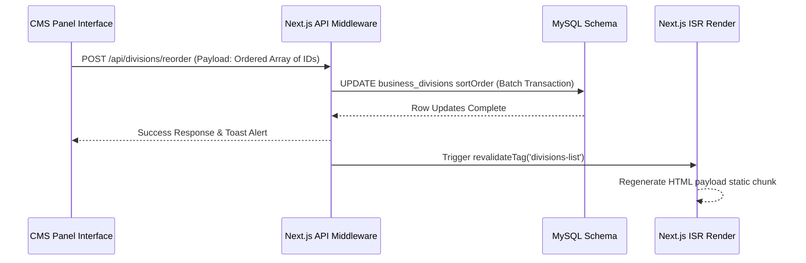
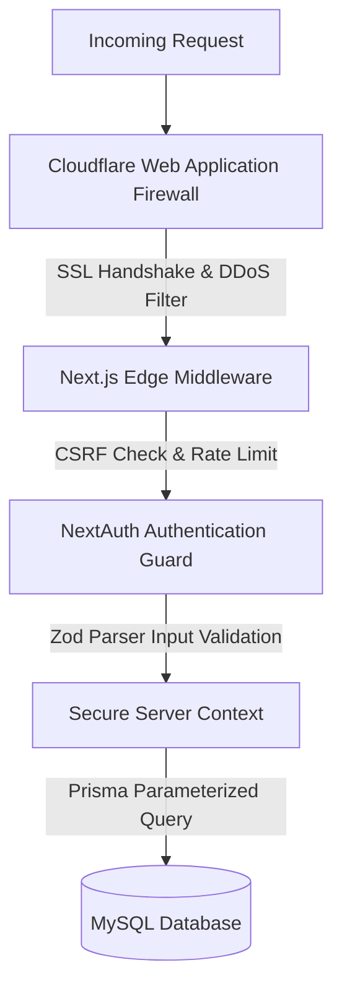

# Medicxus Group Corporate Portfolio Platform
## Enterprise-Grade Technical Blueprint & System Architecture Plan
### Part 2: Admin Panel, CMS & System Optimization (Chapters 7 - 12)

---

## 7. Admin Panel Structure

The Admin Panel operates under `/admin` and is styled using a modern, unified, client-friendly control panel with **Shadcn UI** primitives and custom CSS layout modules. It utilizes TanStack Query for dynamic data management and real-time validation feedback.

### 7.1 Dashboard Layout Design
The interface layout consists of three primary zones:
1.  **Global Sidebar Navigation (Persistent):** Collapsible control rail containing links to each CMS node (Hero, Divisions, Projects, Settings, Enquiries, FAQs, System Logs).
2.  **Telemetry Header:** Shows current user profile info, user role badge (`Super Admin`, `Editor`, `Auditor`), quick actions, and automated database connectivity status indicators.
3.  **Dynamic Workspace Frame:** Responsive content frame optimized for dense forms, audit tables, and grid management dashboards.

```
+------------------------------------------------------------------------+
|  [M] Medicxus Admin    |  Search actions...   [🟢 DB Status]  [Profile] |
+------------------------+-----------------------------------------------+
|  📊 Dashboard          |  Welcome back, Admin!                         |
|  ✨ Hero Section       |  +------------------+  +-------------------+  |
|  📂 Business Units     |  | Active Projects  |  | Total Inquiries   |  |
|  💼 Project Grid       |  |       11         |  |        142        |  |
|  🔬 LIMS & LIMS Links  |  +------------------+  +-------------------+  |
|  📝 Blog Editor        |                                               |
|  🌟 Testimonials       |  Recent System Inquiries                      |
|  ❓ FAQs Manager       |  +-----------------------------------------+  |
|  📨 Contact Leads      |  | Name   | Subject       | Date     | Act |  |
|  ⚙️ Settings           |  |--------|---------------|----------|-----|  |
|  🔒 System Logs        |  | John   | LIMS Demo Request | May 31 | [v] |  |
+------------------------+--+-----------------------------------------+--+
```

### 7.2 Interactivity & State Management Flow
*   **Optimistic UI Updates:** State mutations in grid interfaces (e.g. toggling visibility of a project or changing its order) immediately update the local client state. If the backend API fails, the application uses TanStack Query’s `onError` handler to seamlessly roll back the interface to the last known healthy state, alerting the administrator via toast notifications.
*   **WYSIWYG Integration (TipTap):** Built on React Editor frameworks to output structured JSON configurations and semantic HTML for blog layouts and rich description paragraphs.

---

## 8. User Roles & RBAC

The application employs a role-based access control matrix (RBAC) to restrict interface access and API paths based on organizational hierarchy. 

### 8.1 RBAC Privilege Matrix

| Operation Category | System Route Path | Super Admin | Editor | Auditor |
| :--- | :--- | :---: | :---: | :---: |
| **System Security & Logs** | `/admin/settings`, `/api/admin/logs` | ✅ Read/Write | ❌ No Access | 👁️ Read-Only |
| **User & Staff Accounts** | `/admin/users`, `/api/admin/users` | ✅ Read/Write | ❌ No Access | ❌ No Access |
| **Corporate Portfolio** | `/admin/projects`, `/api/projects` | ✅ Read/Write | ✅ Read/Write | 👁️ Read-Only |
| **Division Definitions** | `/admin/divisions`, `/api/divisions` | ✅ Read/Write | ✅ Read/Write | 👁️ Read-Only |
| **Client Leads & Inquiries** | `/admin/inquiries`, `/api/inquiries` | ✅ Read/Write | ✅ Read/Write | 👁️ Read-Only |
| **Blog & FAQ CMS** | `/admin/blogs`, `/api/blogs` | ✅ Read/Write | ✅ Read/Write | 👁️ Read-Only |

### 8.2 NextAuth Authentication Flow with Custom Claims
NextAuth processes session operations at the server level, appending JWT database mappings and access roles directly to the cookie session context:

```typescript
// src/app/api/auth/[...nextauth]/route.ts
import NextAuth, { NextAuthOptions } from "next-auth";
import CredentialsProvider from "next-auth/providers/credentials";
import { prisma } from "@/lib/prisma";
import bcrypt from "bcryptjs";

export const authOptions: NextAuthOptions = {
  session: {
    strategy: "jwt",
    maxAge: 8 * 60 * 60, // Enforce session expiry after exactly 8 hours of inactivity
  },
  providers: [
    CredentialsProvider({
      name: "Medicxus Control Portal",
      credentials: {
        username: { label: "Username", type: "text" },
        password: { label: "Password", type: "password" }
      },
      async authorize(credentials) {
        if (!credentials?.username || !credentials?.password) {
          throw new Error("Credentials required");
        }

        const user = await prisma.user.findUnique({
          where: { username: credentials.username }
        });

        if (!user) {
          throw new Error("Account not found");
        }

        const isValid = await bcrypt.compare(credentials.password, user.password);
        if (!isValid) {
          throw new Error("Invalid access password");
        }

        return {
          id: user.id,
          email: user.email,
          name: user.name,
          role: user.role
        };
      }
    })
  ],
  callbacks: {
    async jwt({ token, user }) {
      if (user) {
        token.id = user.id;
        token.role = user.role;
      }
      return token;
    },
    async session({ session, token }: any) {
      if (token) {
        session.user.id = token.id;
        session.user.role = token.role;
      }
      return session;
    }
  },
  pages: {
    signIn: "/login",
    error: "/login"
  }
};

const handler = NextAuth(authOptions);
export { handler as GET, handler as POST };
```

---

## 9. CMS Structure

To completely eliminate hardcoded values, the database holds configurations for every text node, button, background gradient coordinate, and graphic item. This ensures complete layout customizability through a user-friendly administration dashboard.

### 9.1 CMS Module Schemas

#### 1. Hero Content Module
*   **Headline Matrix:** Direct field mapping of `Part 1`, `Part 2 (Teal Color)`, and `Part 3 (Amber Color)` (e.g. *Empowering*, *Healthcare*, *Transforming Lives*).
*   **Subtitle Text:** Multi-line text field (`hero-sub`).
*   **Call-to-Action Links:** Separate forms configuration mapping URL destinations and text labels for Primary (`Explore Our Divisions`) and Secondary (`Learn About Us`) actions.
*   **Orbs/Glow Coordinates:** Advanced setting to toggle visibility or customize overlay background values of gradient light zones (`hero-orb-1`, `hero-orb-2`, `hero-orb-3`).

#### 2. Business Divisions Module
*   **Icon Library Selector:** Inline dropdown supporting local SVG uploads and verified unicode emojis (`🎓`, `🏥`, `🌍`, `💻`).
*   **Theme Background Class:** Selectable theme wrapper (`icon-blue`, `icon-teal`, `icon-amber`, `icon-purple`).
*   **Link Routing Destination:** Maps clicking actions to either external child sub-sites or internal project route segments.
*   **Reordering Engine:** Drag-and-drop hierarchy listing to update integer sorting codes dynamically.



#### 3. Dynamic Projects & Services Card Module
*   **Title, Description & Slug Config:** Creates clean search parameters automatically.
*   **Upload Container:** Processes custom thumbnail graphic uploads.
*   **Target URI Endpoint:** Absolute path reference to primary sub-sites (e.g. `careinstitute.com`).
*   **Status Selector:** Enum dropdown mapping project status indicators (`Active`, `In Development`, `Maintenance`, `Redirected`).

#### 4. Team Members & Testimonials Module
*   **Author Details:** Real-time upload fields for author photos (`avatarUrl`), official title, client company context, and a 1-5 rating slider.

#### 5. Corporate Info & Global Metadata
*   **Contact Information:** Direct configuration forms mapping email addresses, contact phone numbers, social media channel URLs, and legal copyrights terms.

---

## 10. SEO Architecture

The system utilizes Next.js’s dynamic **Metadata API** paired with structural schemas to maximize crawler search indices, achieving top scores across search engines.

### 10.1 Structured Metadata Injection Example
To dynamic resolve SEO configurations directly at server boundary:

```typescript
// src/app/page.tsx
import { Metadata } from "next";
import { prisma } from "@/lib/prisma";

export async function generateMetadata(): Promise<Metadata> {
  const seoConfig = await prisma.systemSetting.findUnique({
    where: { key: "global_seo" }
  });
  
  const parsed = seoConfig ? JSON.parse(seoConfig.value) : {
    title: "Medicxus Group",
    description: "Empowering Healthcare. Transforming Lives."
  };

  return {
    title: `${parsed.title} – Sovereign Blue`,
    description: parsed.description,
    metadataBase: new URL("https://medicxus.com"),
    openGraph: {
      title: parsed.title,
      description: parsed.description,
      url: "https://medicxus.com",
      siteName: "Medicxus Group Portal",
      images: [
        {
          url: "/assets/og-image.jpg",
          width: 1200,
          height: 630,
          alt: "Medicxus Group Brand Cover Image"
        }
      ],
      locale: "en_US",
      type: "website",
    },
    twitter: {
      card: "summary_large_image",
      title: parsed.title,
      description: parsed.description,
      images: ["/assets/og-image.jpg"],
    },
    robots: {
      index: true,
      follow: true,
      googleBot: {
        index: true,
        follow: true,
        "max-video-preview": -1,
        "max-image-preview": "large",
        "max-snippet": -1,
      },
    },
  };
}
```

### 10.2 Structured JSON-LD Data Injection
Google structural graphs are dynamically rendered within root server layouts to index the organization and its multi-divisional structure:

```html
<script
  type="application/ld+json"
  dangerouslySetInnerHTML={{
    __html: JSON.stringify({
      "@context": "https://schema.org",
      "@type": "MedicalOrganization",
      "name": "Medicxus Group",
      "url": "https://medicxus.com",
      "logo": "https://medicxus.com/assets/logo.png",
      "sameAs": [
        "https://linkedin.com/company/medicxus",
        "https://twitter.com/medicxus",
        "https://facebook.com/medicxus"
      ],
      "department": [
        {
          "@type": "EducationalOrganization",
          "name": "Care Institute of Health Sciences"
        },
        {
          "@type": "MedicalBusiness",
          "name": "Medicxus Diagnostic"
        }
      ]
    })
  }}
/>
```

---

## 11. Security Architecture

The application adopts a **Defense-in-Depth** security philosophy. Because the platform contains healthcare organization metadata, it implements multiple layers of protection to ensure operational resilience.

### 11.1 Key Security Defenses



*   **SQL Injection (SQLi) Prevention:** All data transactions utilize **Prisma ORM**, which naturally generates parameterized queries. This ensures user inputs are never executed as direct instructions, completely neutralizing SQLi risks.
*   **Cross-Site Scripting (XSS) Mitigation:** All TipTap output content rendered inside standard markdown wrappers utilizes **DOMPurify** to strip executable javascript tags. Next.js naturally blocks unescaped dynamic outputs, unless the `dangerouslySetInnerHTML` tag is explicitly used.
*   **Next.js Security Middleware Headers:** Global configurations enforce strict Content Security Policies (CSP), Frame-Options (denying iframe hijacking attempts), and strict SSL transport requirements.
*   **Input Validation Shield:** All API endpoints validate incoming payloads against strict Zod schemas before processing, rejecting unrecognized fields.

---

## 12. Performance Architecture

To maintain a sub-second Time-to-Interactive (TTI), the application implements strict image optimization, code-splitting, database connection pooling, and asset distribution strategies.

### 12.1 Performance Strategy Matrix

```text
Performance Target: Page Speed Score 100/100 (Core Web Vitals)
├── Image Assets           --> next/image optimization, responsive size attributes, auto WebP format
├── CSS & Styling          --> CSS custom property mapping inside compiled Tailwind bundle (no runtime style bloat)
├── Bundle Sizes           --> Dynamic React.lazy imports for high-weight admin views (e.g. TipTap)
├── DB Connection Pool     --> Next.js serverless connection reuse, Prisma query pooling parameters
└── Server Response (TTFB) --> Vercel Edge caching and Redis database session caching
```

### 12.2 Critical Implementation Details
*   **Prisma Database Connection Pooling:** Configured inside production environments (`DATABASE_URL="mysql://root@localhost/businessportfoliomadixcusdata?connection_limit=20&pool_timeout=10"`) to reuse open database connections, preventing connection leaks during traffic spikes.
*   **Dynamic Asset Optimization:** Public landing illustrations are served through optimized Next.js Image components (`next/image`), converting uploads into **WebP/AVIF format** with responsive breakpoints.
