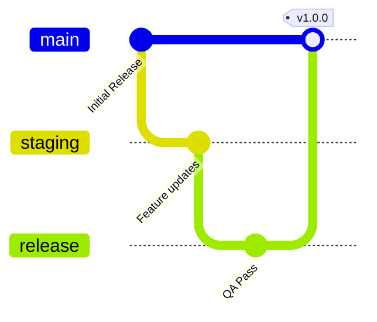

# Medicxus Group Corporate Portfolio Platform
## Enterprise-Grade Technical Blueprint & System Architecture Plan
### Part 3: Operations, Scale, SaaS & Infrastructure (Chapters 13 - 20)

---

## 13. Deployment Strategy

The deployment pipeline is designed around containerized infrastructure to guarantee predictability, isolation, and horizontal scalability across environments.

### 13.1 Production Environment Deployment Lifecycle



1.  **Local Development:** Run locally in a Node.js runtime environment using a local MySQL server instance (`businessportfoliomadixcusdata`).
2.  **Staging Environment:** Pushed changes are automatically deployed to a staging server via Github Action workflows. Staging uses an isolated clone of the production database for validation.
3.  **Production Gate:** Pushing to the `main` branch triggers a multi-stage Docker build pipeline, running automated Zod validation tests and build compilation checks before routing traffic to the updated containers.

### 13.2 Multistage Docker Configuration Blueprint
Below is the highly optimized production Docker configuration for Next.js 15:

```dockerfile
# Stage 1: Dependency Installer
FROM node:20-alpine AS deps
WORKDIR /app
COPY package*.json ./
RUN npm ci

# Stage 2: Compiler & Builder
FROM node:20-alpine AS builder
WORKDIR /app
COPY --from=deps /app/node_modules ./node_modules
COPY . .
ENV NEXT_TELEMETRY_DISABLED=1
ENV NODE_ENV=production
RUN npx prisma generate
RUN npm run build

# Stage 3: Runner
FROM node:20-alpine AS runner
WORKDIR /app
ENV NODE_ENV=production
ENV PORT=3000
ENV HOSTNAME="0.0.0.0"
RUN addgroup --system --gid 1001 nodejs
RUN adduser --system --uid 1001 nextjs

COPY --from=builder /app/public ./public
COPY --from=builder --chown=nextjs:nodejs /app/.next/standalone ./
COPY --from=builder --chown=nextjs:nodejs /app/.next/static ./.next/static
COPY --from=builder --chown=nextjs:nodejs /app/prisma ./prisma

USER nextjs
EXPOSE 3000
CMD ["node", "server.js"]
```

---

## 14. Scalability Strategy

To handle high traffic volume across multiple child platforms, the platform architecture implements caching, connection management, and database scaling plans.

```
       [ Client Request ]
               │
      [ CDN / Edge Cache ] (Sub-second static assets)
               │
    [ Load Balancer (Nginx) ]
      /        │        \
[App Node] [App Node] [App Node] (Dockerized Next.js Web Layers)
      \        │        /
       [ Redis Cache ] (Session & dynamic API Caching)
               │
     [ MySQL Master DB ]  ──  Replication  ──>  [ MySQL Read Replica ]
     (Writes / Updates)                         (Reporting & Public Queries)
```

### 14.1 Key Scalability Policies
*   **Database Read-Write Separation:** The application separates database operations:
    *   **Master Write Database:** Handles CRUD operations in the Admin dashboard.
    *   **Read Replicas:** Serves public-facing page requests and project card metadata.
*   **Redis Caching Layers:** Redis acts as the caching layer for session storage, audit logs, and external project click configurations. This reduces database queries during peak traffic.
*   **Edge CDN Caching:** Asset distribution is handled at the network edge via Cloudflare, caching static items (like icons, CSS sheets, and optimized images) to reduce server load.

---

## 15. Future SaaS Expansion Strategy

A key long-term goal of the Medicxus platform is its ability to scale. Eventually, child brands (like Care Institute or Medicxus Diagnostic) will evolve from simple project cards into fully functional web applications managed under a centralized SaaS administration framework.

### 15.1 Multi-Tenant Database Architecture
To transition the platform to a SaaS model, the database schema is updated to support multi-tenant isolation through a dedicated `Tenant` model:

```prisma
// Multi-Tenant Extension Snippet
model Tenant {
  id           String    @id @default(uuid())
  domainName   String    @unique // e.g. "careinstitute.com"
  subdomain    String    @unique // e.g. "care-institute.medicxus.com"
  companyName  String
  themeConfig  String    @db.Text // JSON properties defining site colors & assets
  isActive     Boolean   @default(true)
  createdAt    DateTime  @default(now())
  
  // Isolated dynamic assets
  projects     TenantProject[]
  users        TenantStaff[]
}
```

### 15.2 Subdomain Mapping Mechanisms
*   **Next.js Dynamic Middleware Routing:** Edge middleware detects the hostname of incoming requests. It dynamically rewrites the internal request path to render tenant-specific content from a shared code structure, all while preserving the user's custom domain in the address bar:
    ```typescript
    // Example: Subdomain mapping rewrite logic
    const url = req.nextUrl;
    const hostname = req.headers.get("host") || "";
    
    if (hostname !== "medicxus.com" && hostname !== "localhost:3000") {
      // Rewrite request internally: careinstitute.com/about => /_tenants/careinstitute/about
      url.pathname = `/_tenants/${hostname}${url.pathname}`;
      return NextResponse.rewrite(url);
    }
    ```

---

## 16. Content Management Strategy

To maintain content accuracy and operational accountability in a multi-user environment, the CMS features structured editorial workflows and a comprehensive audit trail.

```
[ Draft Content ] ── (Editor Submits) ──> [ Awaiting Review ] ── (Super Admin Approves) ──> [ Published ]
```

### 16.1 Editorial Workflow Matrix

*   **Draft State:** Content created by Editors is saved locally without affecting public pages.
*   **Awaiting Review:** The content is submitted for verification, notifying Super Admins through the dashboard.
*   **Published State:** The change is committed to the main database and triggers tag revalidation to update the static public-facing pages.

### 16.2 Automated Revision & Audit Logs
Any change to business units, projects, or settings creates an entry in the system logs, capturing the exact user, target action, client IP, and changes:

```typescript
// System Utility to record audit trails
export async function logAction(userId: string, action: string, target: string, ip: string) {
  await prisma.auditLog.create({
    data: {
      userId,
      action,
      target,
      ipAddress: ip
    }
  });
}
```

---

## 17. Analytics Strategy

A central corporate portfolio needs clear metrics to measure traffic distribution and user engagement across its business divisions.

### 17.1 Click Redirect Analytics Engine
When a user clicks on a division or project card, the action is routed through an internal tracking endpoint before redirecting to the final destination URL:

```typescript
// src/app/api/redirect/[projectId]/route.ts
import { NextRequest, NextResponse } from "next/server";
import { prisma } from "@/lib/prisma";

export async function GET(req: NextRequest, { params }: { params: { projectId: string } }) {
  try {
    const { projectId } = params;

    // Increment click counter asynchronously
    const project = await prisma.project.update({
      where: { id: projectId },
      data: { clickCount: { increment: 1 } },
      select: { targetUrl: true }
    });

    // Perform HTTP 302 temporary redirect to target site
    return NextResponse.redirect(new URL(project.targetUrl));
  } catch (error) {
    return NextResponse.redirect(new URL("https://medicxus.com"));
  }
}
```

### 17.2 KPI Dashboard Telemetry Metrics
The Admin Panel visualizes this tracking through interactive analytics components, providing insights into:
*   **Direct Traffic Distribution:** Click-through rate (CTR) across each business division.
*   **Lead Acquisition Insights:** Real-time metrics showing form submissions categorized by division.
*   **Content Trends:** Engagement statistics for the system blogs and resource centers.

---

## 18. Project Linking Strategy

To ensure seamless integration across the corporate network, the platform utilizes dynamic link checking and proxy routing architectures.

### 18.1 Link Integrity Checking Pipeline
An automated cron job checks the availability of all external project and division links daily:

```typescript
// Example: src/scripts/link-checker.ts
export async function runLinkChecks() {
  const projects = await prisma.project.findMany({ select: { id: true, targetUrl: true } });
  
  for (const project of projects) {
    try {
      const res = await fetch(project.targetUrl, { method: "HEAD", timeout: 5000 } as any);
      const status = res.status < 400 ? "ACTIVE" : "REDIRECTED";
      
      await prisma.project.update({
        where: { id: project.id },
        data: { status }
      });
    } catch {
      await prisma.project.update({
        where: { id: project.id },
        data: { status: "REDIRECTED" }
      });
    }
  }
}
```

### 18.2 Fallback Routing Architecture
*   **Redirect Handling:** If a project website experiences an outage (indicated by a non-200 response), the main portfolio automatically updates the card status, redirecting clicks to a customized "Coming Soon" or "Maintenance" page on the portfolio platform. This maintains a clean and unbroken user experience.

---

## 19. Media Management Strategy

Managing images, project thumbnails, and documents is built on local storage to start, but is designed for seamless cloud migration when the business scales.

### 19.1 Local Media Upload Pipeline
All media uploads are validated, optimized, and saved locally inside the `/public/uploads` directory:

```typescript
// Example: src/app/api/media/route.ts
import { NextRequest, NextResponse } from "next/server";
import { writeFile } from "fs/promises";
import path from "path";
import crypto from "crypto";

export async function POST(req: NextRequest) {
  try {
    const data = await req.formData();
    const file: File | null = data.get("file") as unknown as File;

    if (!file) {
      return NextResponse.json({ success: false, message: "File missing" }, { status: 400 });
    }

    const bytes = await file.arrayBuffer();
    const buffer = Buffer.from(bytes);

    // Generate unique name
    const hash = crypto.randomBytes(8).toString("hex");
    const filename = `${hash}-${file.name.replace(/[^a-zA-Z0-9.]/g, "_")}`;
    const uploadPath = path.join(process.cwd(), "public/uploads", filename);

    await writeFile(uploadPath, buffer);

    return NextResponse.json({
      success: true,
      url: `/uploads/${filename}`
    });
  } catch (error: any) {
    return NextResponse.json({ success: false, error: error.message }, { status: 500 });
  }
}
```

### 19.2 Cloud Migration Blueprint (S3 Readiness)
To shift media to cloud storage in the future, the file upload system relies on a generic abstraction interface. Migrating to Amazon S3 simply requires implementing the `StorageProvider` interface, avoiding updates to the core application code:

```typescript
export interface StorageProvider {
  uploadFile(file: Buffer, filename: string): Promise<string>;
  deleteFile(fileUrl: string): Promise<boolean>;
}
```

---

## 20. Backup & Recovery Strategy

To protect corporate data against system failures, the database uses automated backup processes and point-in-time recovery plans.

### 20.1 MySQL Automated Backup Workflow

```text
               +---------------------------+
               | MySQL Production Database |
               +-------------+-------------+
                             │
            (Daily cron runsmysqldump script)
                             │
                             ▼
              +-----------------------------+
              | Encrypted GZ Compressed Dump|
              +--------------+--------------+
                             │
               (Upload to Secure S3 Storage)
                             │
                             ▼
              +-----------------------------+
              | AWS S3 Archive Bucket (WORM)|
              +-----------------------------+
```

*   **Daily Snapshots:** A lightweight backup script dumps the MySQL database every 24 hours, compresses the data into an encrypted archive, and uploads it to an isolated, write-once storage bucket.
*   **Database Migrations Rollbacks:** Each Prisma migration (`prisma migrate deploy`) is validated in staging. If a migration fails in production, the pipeline triggers a rollback to the previous migration state and restores database records from the daily snapshot.

### 20.2 Disaster Recovery Runbook
1.  **Outage Detection:** System alerts trigger on 500 response codes or failed health checks.
2.  **Infrastructure Provisioning:** Deploy a clean container stack using the latest stable Docker image from the registry.
3.  **Data Recovery:** Download the latest encrypted backup archive, restore schemas, and execute any pending Prisma migrations.
4.  **Traffic Routing:** Update DNS records through Cloudflare to point traffic back to the newly restored server instance, keeping total downtime under 15 minutes.
